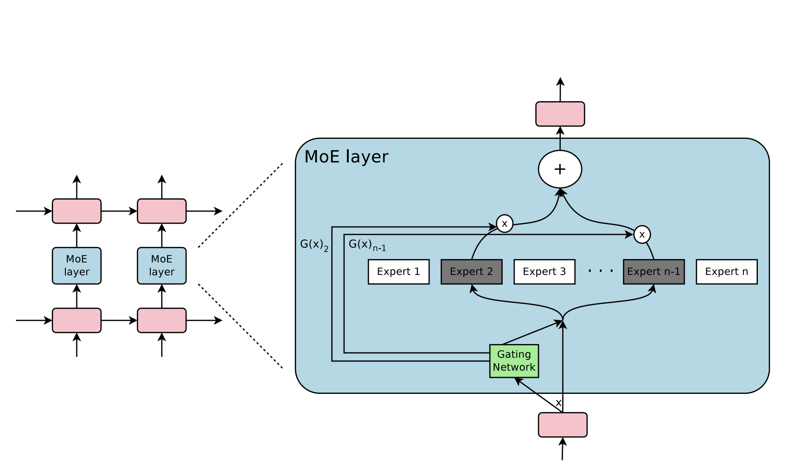

# min Mixture of Experts

Mixture of Experts (MoE) :- a machine learning technique that combines experts modelt to improve the performance,

Expert : are neural networks trained on a specific task.

Gating : playing important role in MoE by selecting the appropriate expert for each input, also calle Router.

MoE variants : 
1) **Hard MoE** : assign input data for a specific expert.
2) **Soft MoE** : assign for multiple experts.
3) **Sparse MoE** : uses a subset of experts for a particular input.
4) **Adaptive MoE** : The number of active experts adapt dynamically.
5) **Hierarchical MoE** : multi-layer of expertise models.

MoE module output : 
$$
y =\sum_{i=1}^{n-1} G(x) - E_i(x)
$$

G(x) denotes the n-dimensional output of the gating network for the i-th expert

$$
G(x) = \text{Softmax}(\text{TopK}(x \cdot W_g))
$$

K : the number of experts used per token

$$
y = \sum_{i=0}^{n-1} \text{Softmax}(\text{Top2}(x \cdot W_g))_i \cdot \text{SwiGLUi}(x)
$$

### Refrences : 
Paper : https://arxiv.org/pdf/1701.06538.pdf
 
Articles : 
- https://huggingface.co/blog/moe
- https://medium.com/@yacinebouaouni07/mixture-of-experts-26243919d145
 
